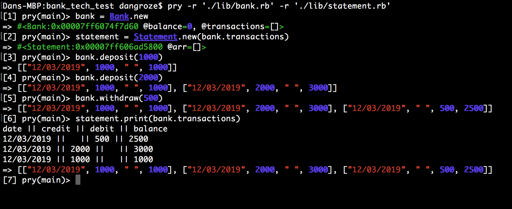

### Requirements

* You should be able to interact with your code via a REPL like IRB or the JavaScript console.  (You don't need to implement a command line interface that takes input from STDIN.)
* Deposits, withdrawal.
* Account statement (date, amount, balance) printing.
* Data can be kept in memory (it doesn't need to be stored to a database or anything).

### Acceptance criteria

**Given** a client makes a deposit of 1000 on 10-01-2012  
**And** a deposit of 2000 on 13-01-2012  
**And** a withdrawal of 500 on 14-01-2012  
**When** she prints her bank statement  
**Then** she would see

```
date || credit || debit || balance
14/01/2012 || || 500.00 || 2500.00
13/01/2012 || 2000.00 || || 3000.00
10/01/2012 || 1000.00 || || 1000.00
```
### My Test solution is as follows

* User stories
```
As a user,
So that I can know how to manage my money
I want to see my balance
```

```
As a user,
So that I can increase the balance
I want to deposit money
```

```
As a user,
So I can use money
I want to be able to withdraw money
```

```
As a user,
I want to be able to print out a statement in the following format

date || credit || debit || balance
```
### To run the program: 

* Fork or clone this repository
```
git clone https://github.com/dangroze/bank_tech_test.git
```
* Open terminal, go to the file location
* Run bundle install
* type in: pry
* follow instructions in the screenshot:



## Testing the app

* Open terminal, go to cloned folder
* Type in rspec